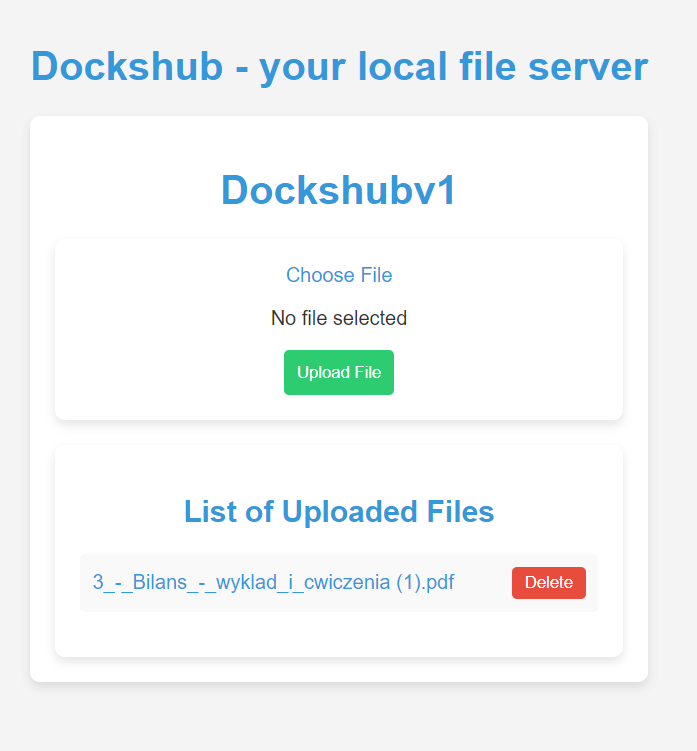

# Project Name
> Dockshub

## Table of Contents
* [General Info](#general-information)
* [Technologies Used](#technologies-used)
* [Features](#features)
* [Screenshots](#screenshots)
* [Setup](#setup)
* [Usage](#usage)
* [Project Status](#project-status)
* [Room for Improvement](#room-for-improvement)
* [Acknowledgements](#acknowledgements)
* [Contact](#contact)
<!-- * [License](#license) -->

## General Information
- Provide general information about your project here.
- What problem does it (intend to) solve?
    - This project provides a file server with user friendly interface to keep documents of different format like pdfs, docs, jpgs and more
- What is the purpose of your project?
    - The purpose of this project is to save your documnets 
- Why did you undertake it?
    - Because I needed a software that will provide me a simple web server to save my files
<!-- You don't have to answer all the questions - just the ones relevant to your project. -->

## Technologies Used
- Ruby - version 1.0
- Rails - 7.1.1
- React - version 2.0
- Mongodb - version 3.0

## Features
List the ready features here:
- Saving files
- Browsing files
- Deleting files
- Downloading files

## Screenshots

## Setup
What are the project requirements/dependencies? Where are they listed? A requirements.txt or a Pipfile.lock file perhaps? Where is it located?

Proceed to describe how to install / setup one's local environment / get started with the project.

## Usage
How does one go about using it?
Provide various use cases and code examples here.

`write-your-code-here`

## Project Status
Project is: complete

## Room for Improvement
Include areas you believe need improvement / could be improved. Also add TODOs for future development.

Room for improvement:
- Improvement to be done 1
- Improvement to be done 2

To do:
- Feature to be added 1
- Feature to be added 2

## Acknowledgements
Give credit here.
- This project was inspired by...
- This project was based on [this tutorial](https://www.example.com).
- Many thanks to...

## Contact
Created by [@flynerdpl](https://www.flynerd.pl/) - feel free to contact me!

<!-- Optional -->
<!-- ## License -->
<!-- This project is open source and available under the [... License](). -->

<!-- You don't have to include all sections - just the one's relevant to your project -->
